# 32-Bit 5-Stage Pipelined ARM Processor with Hazard Detection, Forwarding Unit & Asynchronous SRAM Controller


-blue.svg)


[](https://github.com/A-Magpie)
[](https://linkedin.com/in/danial-qorbani)

A synthesizable 32-bit 5-stage pipelined ARM processor implemented in Verilog and verified on the Xilinx Zynq-7000 SoC FPGA (`xc7z010clg400-1`). The architecture features full hardware hazard handling (data forwarding and stall-based hazard detection), speculative branch resolution with pipeline flushes, an integrated condition check engine for conditional execution, a multi-mode barrel shifter, and an asynchronous off-chip SRAM controller.

---

## Table of Contents
1. [Architectural Overview](#architectural-overview)
2. [5-Stage Datapath Breakdown](#5-stage-datapath-breakdown)
   - [Instruction Fetch (IF)](#1-instruction-fetch-if)
   - [Instruction Decode (ID)](#2-instruction-decode-id)
   - [Execute (EXE) & ALU](#3-execute-exe--alu)
   - [Memory Access (MEM)](#4-memory-access-mem)
   - [Write Back (WB)](#5-write-back-wb)
3. [Hazard Handling & Forwarding Unit](#hazard-handling--forwarding-unit)
   - [Hazard Detection Unit](#hazard-detection-unit)
   - [Forwarding Unit (Bypass Network)](#forwarding-unit-bypass-network)
4. [External Asynchronous SRAM Controller](#external-asynchronous-sram-controller)
5. [FPGA Implementation & Synthesis Results](#fpga-implementation--synthesis-results)
6. [Benchmark Simulation & Performance Analysis](#benchmark-simulation--performance-analysis)
7. [Repository Structure](#repository-structure)
8. [Simulation & Synthesis Guide](#simulation--synthesis-guide)

---

## Architectural Overview

The processor implements an ARM-subset 32-bit architecture operating across 5 pipeline stages:
$$\text{IF} \longrightarrow \text{ID} \longrightarrow \text{EXE} \longrightarrow \text{MEM} \longrightarrow \text{WB}$$

```
+-------------------------------------------------------------------------------------------------------+
|                                      ARM 5-STAGE PIPELINE                                             |
|                                                                                                       |
|    +---------+     +---------+     +-----------+     +-----------+     +---------+                    |
|    |   IF    | --> |   ID    | --> |    EXE    | --> |    MEM    | --> |   WB    |                    |
|    | (Fetch) |     | (Decode)|     | (Execute) |     | (Memory)  |     | (Write) |                    |
|    +---------+     +---------+     +-----------+     +-----------+     +---------+                    |
|         ^               |               |                 |                 |                         |
|         |               v               v                 v                 v                         |
|         |        +-------------+  +---------------------------------------------+                     |
|         |        | Hazard Unit |  |               Forwarding Unit               |                     |
|         |        +-------------+  +---------------------------------------------+                     |
|         |         (Stall/Flush)           (ALU Operand Data Bypassing)                                |
|         +---------------+                                                                             |
|                         | (Branch Flush / Redirect)                                                   |
+-------------------------------------------------------------------------------------------------------+
```

### Key Architectural Highlights
- **Conditional Execution Engine:** Evaluates ARM status flags ($N, Z, C, V$) against 4-bit instruction condition codes before committing pipeline control signals.
- **Full Data Forwarding Network:** Bypasses computed results from EXE/MEM and MEM/WB pipeline registers directly to ALU operand inputs, resolving Read-After-Write (RAW) data dependencies without pipeline stalls.
- **Hardware Hazard Detection:** Automatically detects load-use data hazards and injects precise single-cycle pipeline stalls and bubble insertions.
- **Negative-Edge Register File Access:** Resolves structural read/write conflicts by clocking register writes on the negative edge (`negedge clk`) while instruction decode reads on `posedge clk`.
- **Off-Chip SRAM Controller:** Connects the processor to 32-bit external asynchronous SRAM using a dedicated multi-state memory controller.

---

## 5-Stage Datapath Breakdown

### 1. Instruction Fetch (IF)
The IF stage maintains program sequencing. It selects between the next sequential address ($\text{PC} + 1$) and a calculated branch target address driven by the EXE stage.

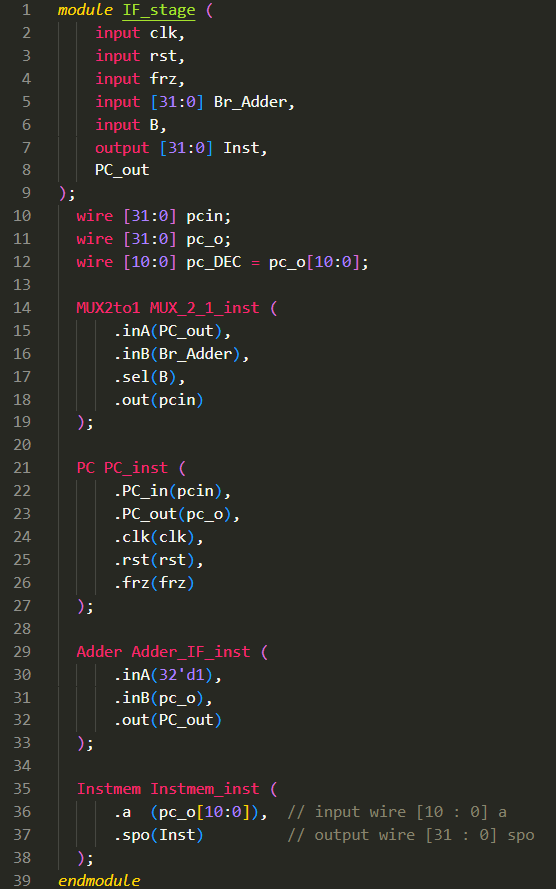

- **Components:**
  - **Program Counter (PC) Register:** Synchronous 32-bit register with clock-enable (`freeze` control from the Hazard Unit).
  - **Branch Multiplexer:** Multiplexes between sequential program flow and branch target vectors when a taken branch or jump is executed.
  - **PC Adder:** Computes sequential next-instruction address.
  - **Instruction Memory IP:** Synthesized using Xilinx Distributed Memory Generator IP loaded with hexadecimal/binary machine code.

---

### 2. Instruction Decode (ID)
The ID stage decodes 32-bit ARM instructions, extracts register operands, generates datapath control signals, and assesses conditional execution.

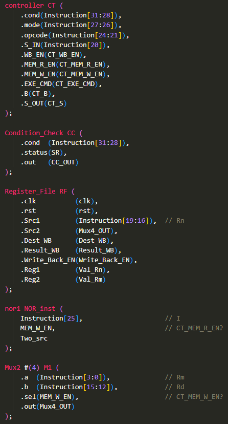

#### Control Unit & Instruction Decoding
The Control Unit decodes OpCodes and Mode bits to drive datapath enables (`Mem_W_EN`, `Mem_R_EN`, `WB_EN`, `B`, `S`, and 4-bit `EXE_CMD`).

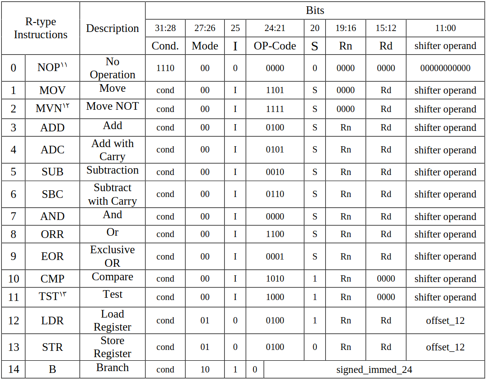

#### Condition Check Logic
ARM instructions support condition fields (`cond[31:28]`). The Condition Check unit compares the instruction condition code against the Status Register flags ($N, Z, C, V$):

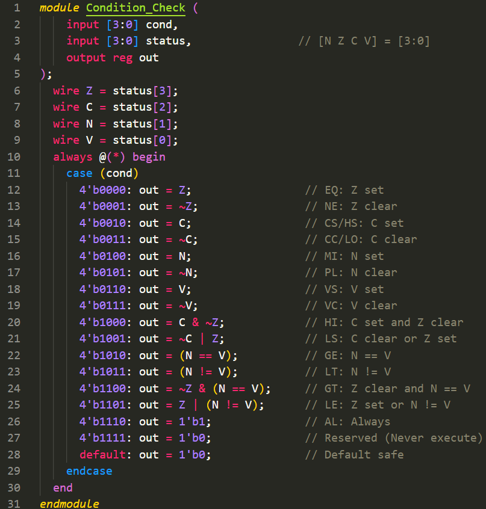

| Cond Code | Mnemonic | Tested Condition | Flag Logic |
|:---:|:---:|:---|:---|
| `0000` | **EQ** | Equal / Zero | $Z = 1$ |
| `0001` | **NE** | Not Equal | $Z = 0$ |
| `0010` | **CS / HS** | Carry Set / Unsigned Higher or Same | $C = 1$ |
| `0011` | **CC / LO** | Carry Clear / Unsigned Lower | $C = 0$ |
| `0100` | **MI** | Minus / Negative | $N = 1$ |
| `0101` | **PL** | Plus / Positive or Zero | $N = 0$ |
| `0110` | **VS** | Overflow Set | $V = 1$ |
| `0111` | **VC** | Overflow Clear | $V = 0$ |
| `1000` | **HI** | Unsigned Higher | $C = 1 \land Z = 0$ |
| `1001` | **LS** | Unsigned Lower or Same | $C = 0 \lor Z = 1$ |
| `1010` | **GE** | Signed Greater Than or Equal | $N = V$ |
| `1011` | **LT** | Signed Less Than | $N \neq V$ |
| `1100` | **GT** | Signed Greater Than | $Z = 0 \land (N = V)$ |
| `1101` | **LE** | Signed Less Than or Equal | $Z = 1 \lor (N \neq V)$ |
| `1110` | **AL** | Always (Unconditional) | `1` |

#### Dual-Port Register File
Contains 16 general-purpose 32-bit registers ($R_0$ through $R_{15}$) with asynchronous dual-read ports and synchronous negative-edge write ports.

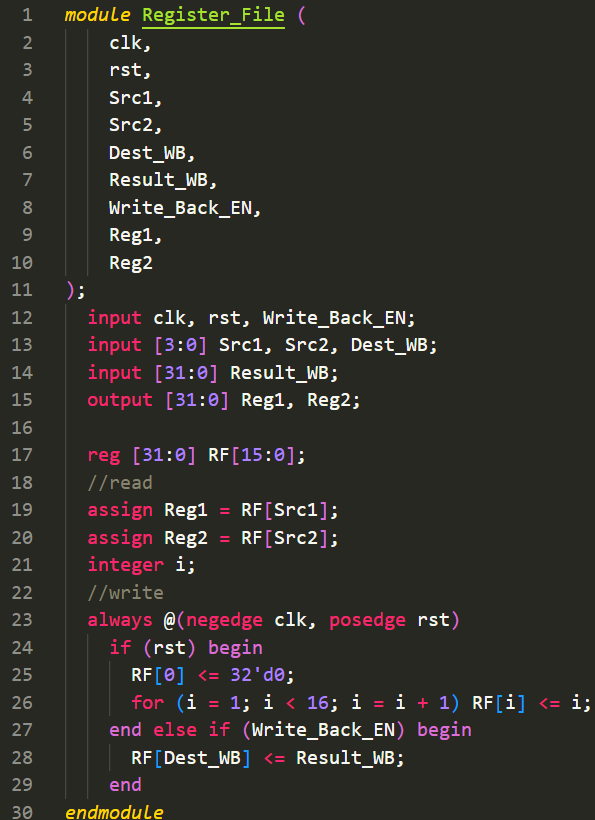

---

### 3. Execute (EXE) & ALU
The EXE stage performs all arithmetic, logical, and address-generation operations.

#### Val2 Generator & Barrel Shifter
Generates the second operand (`Val2`) for the ALU. Depending on the instruction type, it produces:
1. **Immediate Value:** 8-bit immediate rotated right by $2 \times \text{rotate\_imm}$.
2. **Shifted Register:** Register value shifted by immediate shift amount (LSL, LSR, ASR, ROR).
3. **Memory Offset:** 12-bit unsigned offset for load/store operations.

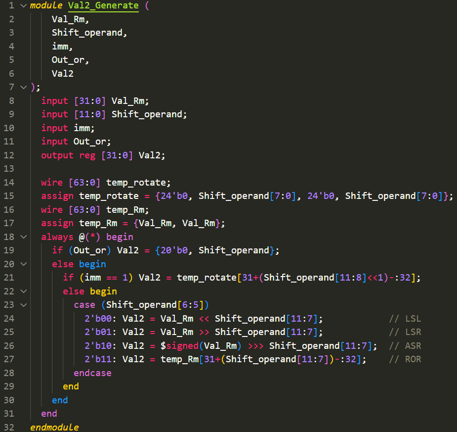

#### Arithmetic Logic Unit (ALU) & Status Flags
The 32-bit ALU executes 16 arithmetic and logical commands defined by `EXE_CMD`:

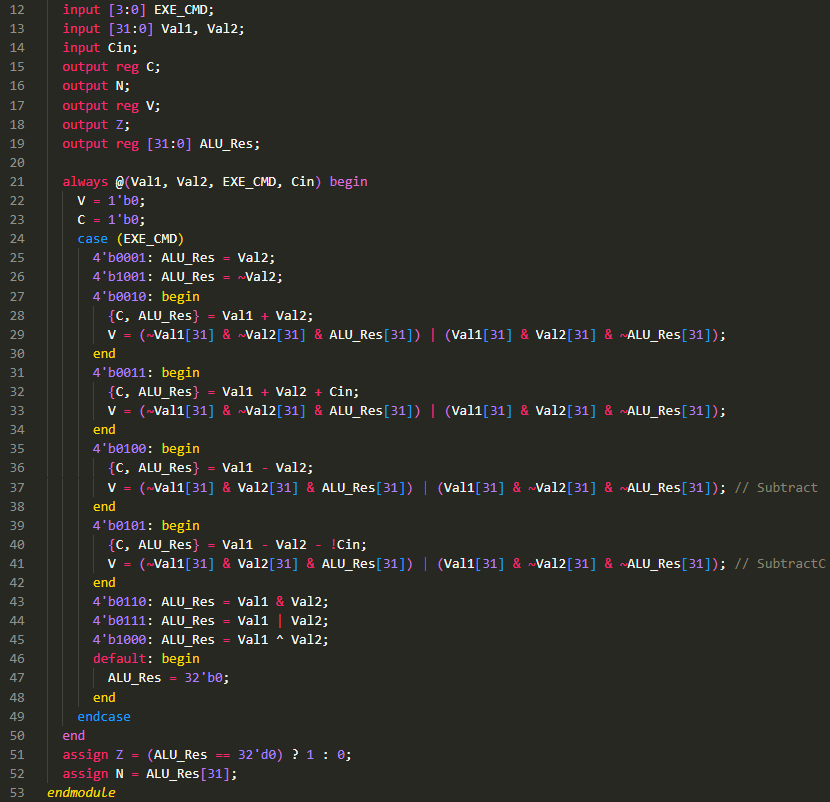

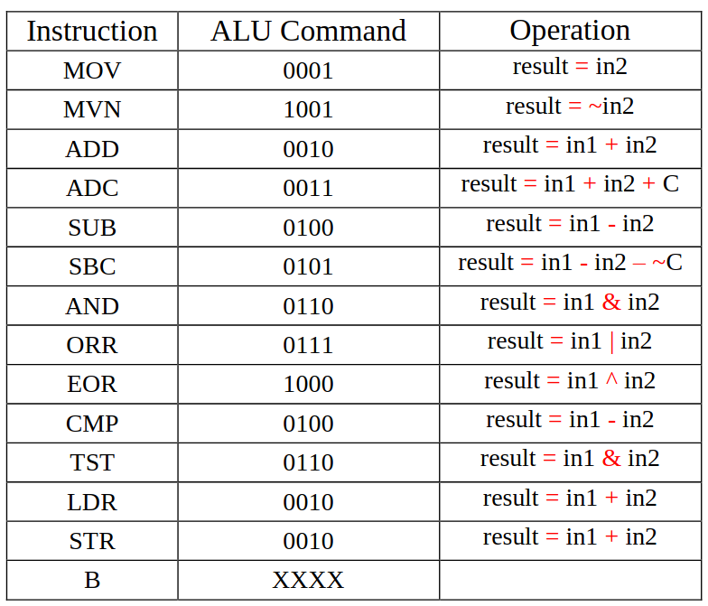

The Status Register computes four status flags:
- **Negative ($N$):** Evaluated from MSB: $N = \text{Result}[31]$.
- **Zero ($Z$):** Evaluated as $Z = (\text{Result} == 0)$.
- **Carry ($C$):** Generated from addition carry-out or subtraction borrow logic.
- **Overflow ($V$):** Detected when two inputs of identical signs produce a result with an inverted sign:
  $$V = (A[31] \land B[31] \land \overline{\text{Res}[31]}) \lor (\overline{A[31]} \land \overline{B[31]} \land \text{Res}[31])$$

---

### 4. Memory Access (MEM)
The MEM stage interfaces to data memory for load (`LDR`) and store (`STR`) instructions.

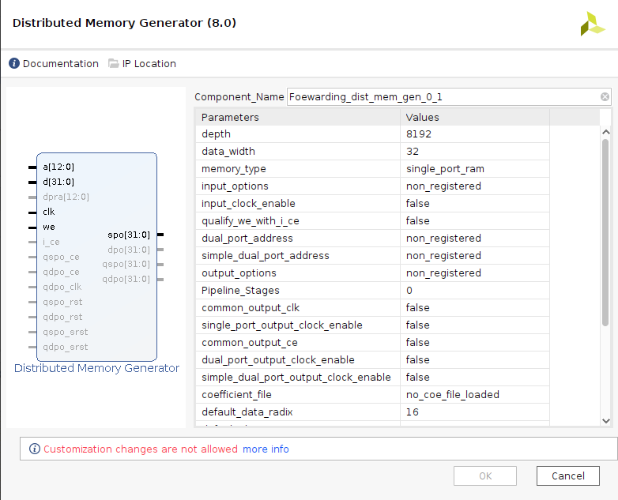

- **Data Memory:** 32-bit distributed RAM module with asynchronous read and synchronous write capabilities.
- **SRAM Interfacing:** Routes memory requests to either internal BRAM or external asynchronous SRAM through the SRAM Controller.

---

### 5. Write Back (WB)
The WB stage completes instruction execution by selecting the destination data (either the calculated ALU result or the loaded memory data) and writing it to the register file.

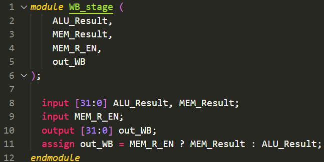

---

## Hazard Handling & Forwarding Unit

In pipelined architectures, dependencies between consecutive instructions introduce hazards that cause pipeline bubbles or corrupt program execution.

### Hazard Detection Unit
Detects structural, control, and data hazards:
- **Load-Use Data Hazard:** Occurs when an instruction requires the result of an immediately preceding `LDR` instruction. The Hazard Unit injects a 1-cycle stall (`freeze = 1`) and inserts a bubble into the EXE pipeline register.
- **Branch Control Hazard:** When a branch condition is verified in the EXE stage, instructions speculatively fetched in IF and ID are cleared using the synchronous `flush` signal.

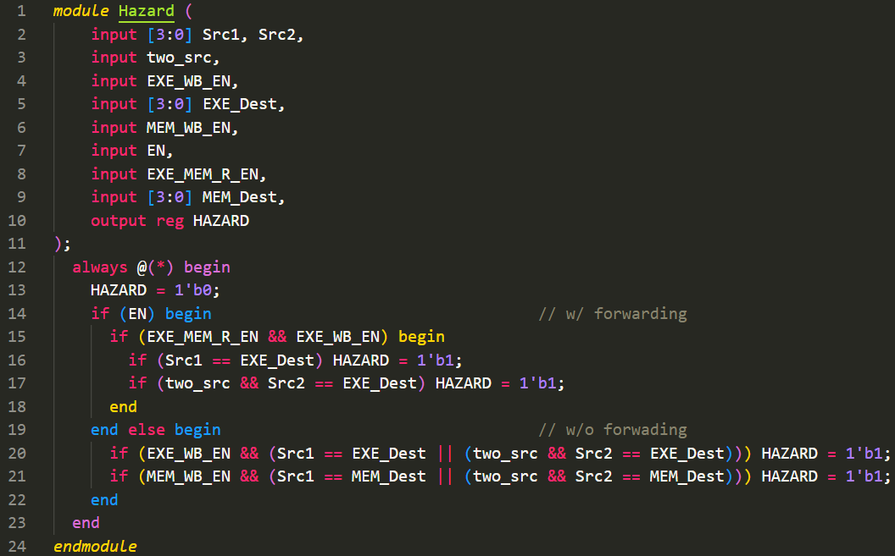

### Forwarding Unit (Bypass Network)
While stalling resolves data dependencies correctly, it introduces significant performance overhead. The Forwarding Unit eliminates RAW stalls by forwarding uncommitted results directly to the ALU inputs.

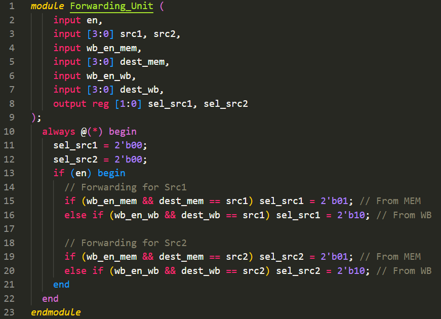

#### Forwarding Multiplexing Logic:
- **Condition `Sel_Src = 2'b00`:** No hazard; operand comes directly from the ID/EXE pipeline register (Register File read data).
- **Condition `Sel_Src = 2'b01`:** Forward from **MEM Stage** (ALU result of previous instruction).
- **Condition `Sel_Src = 2'b10`:** Forward from **WB Stage** (Result of instruction two cycles prior).

---

## External Asynchronous SRAM Controller

To overcome FPGA internal BRAM capacity limitations, the processor incorporates an asynchronous SRAM controller for interfacing with off-chip 32-bit asynchronous SRAM.

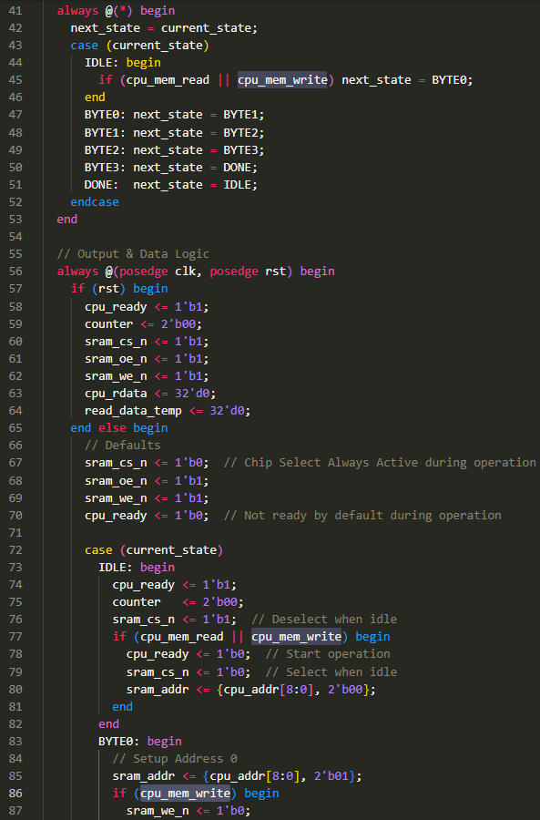

The SRAM controller implements an FSM that generates proper control timing for:
- Chip Enable ($\overline{\text{CE}}$)
- Output Enable ($\overline{\text{OE}}$)
- Write Enable ($\overline{\text{WE}}$)
- 11-bit address bus translation and 32-bit bidirectional data bus buffering.

---

## FPGA Implementation & Synthesis Results

The processor was synthesized, placed, and routed on a **Xilinx Zynq-7000 SoC** (`xc7z010clg400-1`) using **Vivado 2018.3**.

### Resource Utilization Summary

| Resource Type | Used | Available | Utilization (%) |
|:---|:---:|:---:|:---:|
| **Slice LUTs** | **2,506** | 17,600 | **14.24%** |
| $\quad\hookrightarrow$ LUT as Logic | 2,374 | 17,600 | 13.49% |
| $\quad\hookrightarrow$ LUT as Memory (Distributed RAM / SRL) | 132 | 6,000 | 2.20% |
| **Slice Registers (Flip-Flops)** | **2,966** | 35,200 | **8.43%** |
| **Total Slices Occupied** | **1,206** | 4,400 | **27.41%** |
| **Block RAM Tile (BRAM)** | **2** | 60 | **3.33%** |
| **DSPs** | 0 | 80 | 0.00% |
| **Bonded IOBs** | 2 | 100 | 2.00% |

### Vivado Post-Implementation Reports

| Slice LUT Utilization | LUT as Logic Utilization |
|:---:|:---:|
| 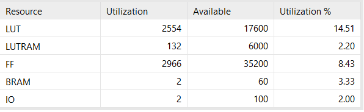 | 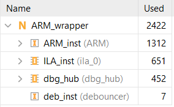 |

| Slice Registers (FFs) | Block RAM Utilization |
|:---:|:---:|
| 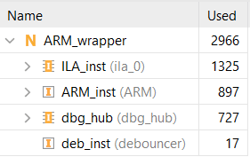 | 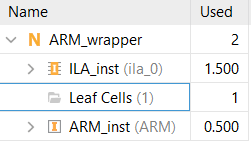 |

### Timing Summary
- **Target System Clock:** $50.0\text{ MHz}$ ($T_{\text{clk}} = 20.000\text{ ns}$)
- **Worst Negative Slack (WNS):** $-1.210\text{ ns}$ (at $50\text{ MHz}$; closes cleanly at $\approx 47.1\text{ MHz}$)
- **Worst Hold Slack (WHS):** $+0.045\text{ ns}$ (Positive margin, zero hold violations)
- **Pulse Width Slack (WPWS):** $+8.750\text{ ns}$

---

## Benchmark Simulation & Performance Analysis

A benchmark test suite consisting of data-dependent arithmetic operations, memory load/stores, and conditional loops was executed on both configurations.

### 1. Execution with Forwarding Unit Enabled
Total execution time: **430 clock cycles**  
Average Cycles Per Instruction: **$\text{CPI} = 2.83$**

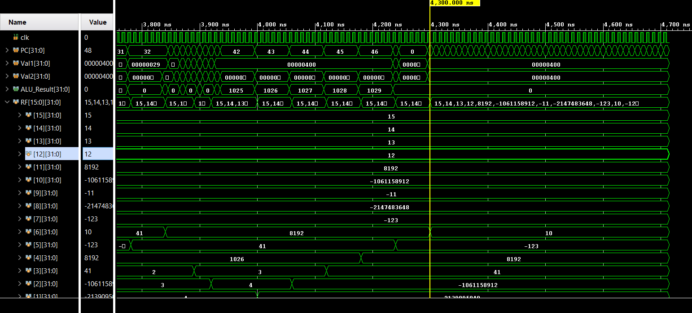

### 2. Execution without Forwarding Unit (Stall-Only)
Total execution time: **517 clock cycles**  
Average Cycles Per Instruction: **$\text{CPI} = 3.40$**

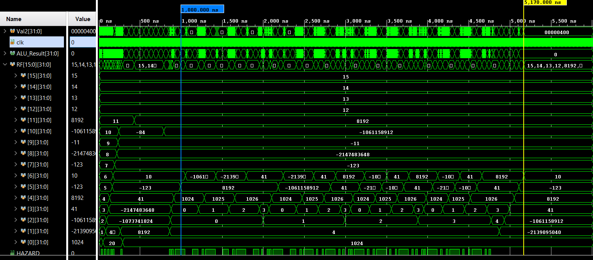

### Performance Comparison & Quantitative Speedup

$$\text{Speedup} = \frac{\text{Cycles}_{\text{without FU}} - \text{Cycles}_{\text{with FU}}}{\text{Cycles}_{\text{without FU}}} = \frac{517 - 430}{517} = \mathbf{16.82\%}$$

$$\text{Performance Ratio} = \frac{\text{Execution Time}_{\text{without FU}}}{\text{Execution Time}_{\text{with FU}}} = \frac{517}{430} \approx \mathbf{1.202\times}$$

| Metric | Without Forwarding Unit | With Forwarding Unit | Relative Gain |
|:---|:---:|:---:|:---:|
| **Total Clock Cycles** | 517 cycles | **430 cycles** | **$-16.82\%$ execution time** |
| **Effective CPI** | 3.40 | **2.83** | **$+16.82\%$ throughput** |
| **Pipeline Bubble Penalties** | 87 stall cycles | **0 RAW stall cycles** | **$100\%$ RAW stalls eliminated** |

---

## Repository Structure

```
ARM-Pipelined-Processor-FPGA/
├── README.md                          # Comprehensive documentation
├── .gitignore                         # Vivado build and artifact exclusions
├── constraints/
│   └── pin_assignment.xdc             # Pin mapping & 50 MHz clock constraint for Zynq-7000
├── rtl/                               # Synthesizable RTL source files
│   ├── ARM.v                          # Top-level ARM processor datapath & control
│   ├── ARM_wrapper.v                  # Board-level wrapper with clock and I/O logic
│   ├── IF_Stage.v                     # Instruction Fetch datapath
│   ├── IF_Stage_Reg.v                 # IF/ID pipeline register
│   ├── ID_Stage.v                     # Instruction Decode datapath
│   ├── ID_Stage_Reg.v                 # ID/EXE pipeline register
│   ├── EXE_Stage.v                    # Arithmetic Execute datapath
│   ├── EXE_Stage_Reg.v                # EXE/MEM pipeline register
│   ├── MEM_Stage.v                    # Memory Access datapath
│   ├── MEM_Stage_Reg.v                # MEM/WB pipeline register
│   ├── WB_Stage.v                     # Write-Back stage multiplexer
│   ├── ALU.v                          # 32-bit ALU (16 arithmetic/logic commands)
│   ├── Control_Unit.v                 # Instruction OpCode and mode decoder
│   ├── Condition_Check.v              # Condition code evaluator (NZCV flags)
│   ├── Register_File.v                # 16x32-bit dual-read negedge-write register file
│   ├── Val2Generator.v                # Barrel shifter & immediate/offset generator
│   ├── Hazard_Unit.v                  # Hardware hazard detector (stalls & flushes)
│   ├── Forwarding_Unit.v              # ALU operand forwarding / bypass unit
│   ├── SRAM_Controller.v              # Asynchronous off-chip SRAM controller FSM
│   ├── Status_Register.v              # NZCV status flag register
│   ├── Register.v                     # Generic synchronous register
│   └── MUX_*.v                        # Parametric multiplexers
├── tb/                                # Verification testbenches and memory init files
│   ├── ARM_Testbench.v                # Top-level pipeline simulation testbench
│   ├── instructions.coe               # Xilinx IP memory initialization vector
│   └── instructions.txt               # Raw test program hex/binary vectors
└── assets/                            # Architecture schematics, waveforms & synthesis reports
    ├── if_stage_schematic.png
    ├── id_stage_schematic.png
    ├── control_unit_schematic.png
    ├── condition_check_logic.png
    ├── register_file_schematic.png
    ├── val2_generator_schematic.png
    ├── alu_schematic.png
    ├── alu_operations_table.png
    ├── mem_stage_schematic.png
    ├── wb_stage_schematic.png
    ├── hazard_unit_schematic.png
    ├── forwarding_unit_schematic.png
    ├── sram_controller_fsm.png
    ├── waveform_with_forwarding_430cycles.png
    ├── waveform_without_forwarding_517cycles.png
    ├── utilization_slice_luts.png
    ├── utilization_lut_logic.png
    ├── utilization_registers.png
    └── utilization_bram.png
```

---

## Simulation & Synthesis Guide

### Simulating in Vivado (Behavioral & Post-Synthesis)
1. Launch **Vivado 2018.3+**.
2. Create a new RTL Project and select the target part: `xc7z010clg400-1`.
3. Add all Verilog design sources from the `rtl/` directory.
4. Add simulation testbenches from `tb/`.
5. Under **Simulation Settings**, ensure timescale is set to `1ns / 1ps`.
6. Run **Run Behavioral Simulation** (`launch_simulation`). Observe waveforms in the Vivado Waveform Viewer.

### Synthesizing & Generating Bitstream
1. Add constraints from `constraints/pin_assignment.xdc`.
2. Run **Run Synthesis** (`launch_runs synth_1 -jobs 4`).
3. Run **Run Implementation** (`launch_runs impl_1 -jobs 4`).
4. Review the generated utilization and timing reports under `Project Summary`.
5. Click **Generate Bitstream** to create the target `.bit` file for hardware programming.

---

## Author & Academic Context

* **Author:** [Danial Ghorbani](https://github.com/A-Magpie)
* **LinkedIn:** [Danial Qorbani](https://linkedin.com/in/danial-qorbani)
* **Degree:** B.Sc. in Electrical Engineering (Electronics), Minor in Computer Engineering
* **Course:** Digital System Design II / Computer Architecture Lab
* **Institution:** School of Electrical and Computer Engineering, University of Tehran
* **Contact:** [daniel.ghorbani.work@gmail.com](mailto:daniel.ghorbani.work@gmail.com)
